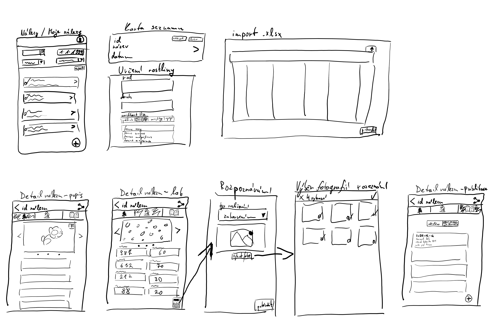

# Úvodní schůzka
**Datum**: 11. 1. 2024  
**Účastníci**: 
 - Bc. Matěj Oliva
 - Mgr. Kateřina Vejvodová
 - RNDr. Libor Ekrt, Ph.D.
   
**Místo setkání**: Stará Boleslav
**Cíl schůzky**: Úvodní schůzka pro pochopení způsobu práce a prvotní sběr požadavků od budoucích uživatelů

## Nalezení vzorku v terénu
Hledání mnohdy probíhá formou expedice více lidí. Skupina může čítat i 20 členů, proto když je vzorek nalezen, není moc prostor a čas se zaobýrat vyplňováním údajů. Cílem je co nejvíce informací předvyplnit automaticky, zbytek bude dopsán zpětně. 

Lokalita bývá mnohdy u nálezů popisována volně a v některých případech i vágně. Bylo by hezké, aby aplikace umožnila exaktnější popis místa (např. 200 metrů od benzínky, nebo od kopce XY).

### Rod, druh a variace nálezu

#### Shrnutí
Ne, vždy lze hned na místě určit druh rostliny, někdy je nutné ji podrobně prozkoumat až v laboratoři a je nutné tedy mít možnost všechny záznamy upravovat zpětně.

Zahrnuje 3 pole: rod, druh a určení druhu. Toto bližší určení rostliny má 4 kategorie. Určení kategorie názvu je v některých případech otázkou preference vědce a přestože mohou vědci kategorii nazývat různě, mohou pak použít stejný název poddruhu. Kategorie těchto variací rostlin jsou:
- varieta,
- morfotyp,
- poddruh a 
- agregát.

Uživatel vybere rod a druh, a pokud chce ještě blíže specifikovat variaci rostliny, kterou našel, zvolí kategorii a vyplní název. Název nemusí existovat, může takto pojmenovat novou mutaci rostliny. Agregát nemá textové pole, jedná se samo o sobě o bližší určení bez dalšího názvu.

#### Komponenta

**Rod** a **druh** live search textfield spojený s dropdown komponentou. Dropdown bude podle zadávaného textu navrhovat doplnění. Pokud vybere uživatel druh jako první, bude rod vyplněn automaticky.

**Kategorie**
Tlačítko **_blíže specifikovat_**, které zobrazí výběr kategorie určení (4 buttony) a textfield. Při výběru kategorie _agregát_ se textfield nezobrazí. Textfield ve stejném stylu rod a druh, ale s možností přidat nový název.

### Lokalita

#### Shrnutí

Určena pomocí souřadnice, ale také určit lokalitu a případně blízký záchytný bod. Určení lokality může být obec, nebo okres, menší oblast je lepší než širší. Záchytný bod, jak 200 metrů jihovýchodně od nejbližší studny nebo kopce. Přidat možnost volitelné poznámky.

Obec a nejbližší záchytný bod ideálně vypočítat, získat ze souřadnic automaticky. Nějaké REST API? K bližšímu prozkoumání nejlepšího způsobu zachytávání umístění. Přečíst: [A new methodology for the retrieval and evaluation of geographic coordinates within databases of scientific plant collections](<https://www.sciencedirect.com/science/article/abs/pii/S0143622817309803>).

**Nice to have**: _"Často bychom chtěli znát podloží, ale z toho  kamene to nepoznáme. Líbilo by se mi, kdybychom byli schopni z té souřadnice získat z nějakého geologického portálu podloží."_

#### Komponenta
Text field pro zadání souřadnice s buttonem pro určení souřadnic z GPS lokátoru zařízení. Obec a záchytný bod text fieldy.

Multiline textfield pro poznámku.

### Fotografie

#### Shrnutí
Fotografií je mnoho druhů od fotografií lokality, makro fotografií rostlin až po laboratorní fotografie. Bylo by dobré mít možnost ty fotografie mezi sebou rozlišovat. _"Mně by se líbilo abych mohla určit tu kategorii až potom, co to vyfotím. Když to vyberu předem, tak pak budu zkoušet různé úhly, a pak zjistím, že vlastně fotím úplně jinou věc, než jsem vybrala."_

#### Komponenta
Galerie z jedné fotografie, posuvná šipkami a tahem. Tlačítko na přidání nové fotografie s výběrem na nahrání ze zařízení, nebo přímo vyfocením. Po nahrání fotky popup s výběrem druhu fotografie a v některých případech i podkategorie (např. rostlina => list, nebo laboratoř => pylová zrna).

### Další parametry

- **Autor nálezu**
  - Získat z přihlášeného profilu jako hlavní autor nálezu
  - I více nálezců
- **Datum a čas nálezu**
  - automaticky s možností úpravy
- **Prostředí/habitat (volitelné)**
  - na skále, u silnice, v mokřadu...
- **Poznámky**
- **ID**
  - inicialyAutora_Rok_Lokalita_IDRostliny
  - aktuálně jsou identifikátory nálezy nejednotné
  - pracovníci si ještě rozmyslí formát
- **Skryté poznámky**
	- vidí pouze autor nebo skupina
	- možnost pozvat
    - slouží pro zapisování poznámek, když si nálezce není jistý některými informacemi a potřebuje si je promyslet před nahráním do systému
- **Způsob archivace**
	- Silikagel a Herbář
    - může být archivováno oběma způsoby
    - tisk štítků

## Laboratoř
Stačí prozatím 4 číselné pole:
- velikost genomu,
- spor,
- délka průduchu a
- amortace

Přidat možnost poznámky (multiline textfield). Tlačítko vypočítat amortaci pro rozpoznání buněk pomocí Deep Learning. Do aplikace se bude nahrávat více fotografií buněk. _Bylo by hezké, pokud by šlo vybrat více fotek najednou a ty počty rovnou sečíst._

### Rozpoznávání buněk
Výběr více fotografií najednou (seznam náhledových dlaždic s možností výběru jednotlivých fotografií). Po zvolení se vyplní pole amortace. (Přidat informaci s jakou jistotou byla amortace vypočítána?).

## Publikace
_"Občas nás další laboratoře požádají o vzorky, aby mohly provést například výzkum DNA a pak nás citují. Chtěli bychom udržovat nějaký seznam komu jsme vzorky posílali a kde pak nás citovali."_

### Parametry

Rozdělení na 2 zobrazení: Odesláno k dalšímu výzkumu a Publikované citace.

- Odesláno k dalšímu výzkumu
	- Jméno instituce
	- Datum
	- Poznámka
- Publikované citace
	- Výpis citací podle určeného citačního standardu

## Seznam nálezů
_"Když zakládáme vzorky, tak je vkládáme buď na papír do herbáře nebo do silikagelu a oba mají různé štítky. Bylo by super, kdybychom už u těch položek viděli, jestli jsme je zakládali do herbáře nebo silikáče."_ 

Přidat možnost označovat více nálezů a ty následně exportovat do tisknutelného formátu. Po exportu položky označit automaticky patřičným tagem **Herbář** nebo **Silikagel**. Dále zahrnout filtrování seznamu, export do excelu a import dat z excelu.

## Moje nálezy
Seznam vlastních nálezů spolu s koncepty. Možnost si předvyplnit různé údaje a nahrát je do databáze až později.

## Náčrty ze schůzky
 