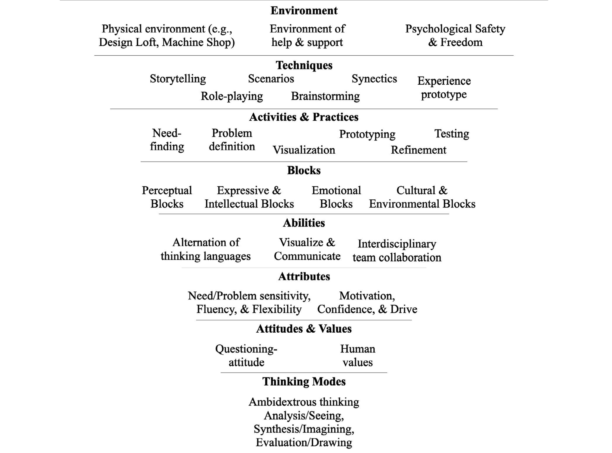

# The origin and evolution of Stanford University's design thinking
**Datum**: 28. 1. 2024  
**Celý název**: The origin and evolution of Stanford University's design thinking: From product design to design thinking in innovation management  
**Citace**: (Auernhammer a Roth 2021)  
**Bibliografie**: AUERNHAMMER, Jan a Bernard ROTH, 2021. The origin and evolution of Stanford University’s design thinking: From product design to design thinking in innovation management. Journal of Product Innovation Management [online]. 38(6), 623–644. ISSN 07376782. Dostupné z: doi:10.1111/jpim.12594  

## Abstrakt 
This article outlines the origin and evolution of one of the most influential design thinking perspectives in the Innovation Management discourse. This study addresses two significant criticisms of design thinking, namely, theoretical grounding and construct clarity. It also illustrates how this humanistic and creative design practice transcended into a comprehensive Innovation Management approach, facilitating entrepreneurship and innovation. Our research analyzes the evolution of the design philosophy and practices developed at Stanford University from 1957 to 2005 through document analysis. We identified design qualities that have been consistent over the decades, providing further construct clarity and insights on managing Design-driven Innovation. These design qualities elucidate design thinking as a cognitive process, creative practice, organizational routine, and design culture. They emphasize finding profound needs and problems and translate them into tangible designs, creating value for people. This design philosophy is deeply rooted in humanistic psychology theories, particularly on creativity and human values. Collaborations between psychologists, industrial researchers, and designers created this creative and human-centered design approach, known today as design thinking. This value-driven innovation offers a humanistic perspective on innovation theory and practice. It also offers an Innovation Management schema of design qualities essential for developing Design-driven Innovation capabilities in organizations and educational institutions. We emphasize that developing a creative design culture in which people have the human values, abilities, and confidence to collaboratively identify continuous emerging problems and needs and contribute through tangible designs generates an era of innovation and is essentially innovation management.

## Úvod
Design thinking se začal nejvíce šířit jako uznávaný pojem pro novou inovační metodiku zhruba od roku 2008[^Brown2008]. V tomto roce jej uvedl v článku _Design Thinking_ Tim Brown, kde zároveň popsal jeho principy. Design thinking nevznikl v roce 2008, jeho praktiky a teorie se zkoumaly již ve 20. století. V té době byly tyto praktiky shrnuty pod metodiky inovačního managementu. Design thinking byl jako konstrukt v roce 2008 spíše pojmenován a zpopularizován, jakožto nový přístup právě inovačního managementu.

3 nejčastější aktivity spojené s metodikou design thinking jsou hledání potřeby (need-finding), ideace (brainstorming) a prototypování(Brown, 2009; Seidel & Fixson, 2013[^Seidel2013]). 

Design thinking je často kritizován za nedostatečné ukotvení praktik a nejasnost výkladu. To vede k vysoké variabilitě její implementace, což může být problematické, jelikož je zde vyšší riziko nedodržování jiných praktik designu a potenciálnímu úpadku kvality. Dalším bodem kritiky je její nedostatek teoretického podkladu zabraňuje efektivní evaluaci metodiky a jejímu dalšímu rozvoji (Auernhammer a Roth 2021[^article]).

### Practitioner points
- Design thinking as a step-by-step process with tools prevents fluency in thinking and flexibility in approach, which are essential in Design-driven Innovation.
- An essential innovation management task is to develop a design culture and capabilities by freeing teamsfrom emerging blocks imposed by the environment.
- In organizations, Design-driven Innovation requires the development of micro-foundation, such as abilities and attitudes & values, and capabilities, such as creative routines and environments of support and psychological safety and freedom.
- Innovation managers and educators need to consider essential design qualities when enabling people to design tangible solution for open and complex problems.

## Metodika
  Práce se zaobírá vývojem filozofie a praxe utvářené v Stanford's Joint Program in Design (JPD) od roku 1957-2005 a porovnává je s kurzy, které začaly vznikat v roce 2005-2006 na téma DT. Výzkum byl proveden hloubkovou analýzou zveřejněných abstraktů kurzů. Po analýze abstraktů vyučovaných předmětů rozdělili období do 5 period, které následně popsali z hlediska vývoje inovation managementu a vzniku design thinking.

## Výsledky
Analýza odhalila 8 témat reprezentujících kvality filozofie designu konzistentní praxe napříč dekádami.

 

První perioda ukazuje na rané teoretické základy, primárně psychologie, výzkumu kreativity a praktik designu. Druhá až čtvrtá se věnují vývoji těchto praktik a metod od roku 1957 do 2005. Poslední perioda zahrnuje aktuální debatu na téma DT v literatuře innovation managementu (Micheli et al., 2019).

### Druhá perioda (1957-1964)
Představení první ucelené, kreativní a humanistické filozofie a praxe designu.  

40s a 50s John E. Arnold
- psycholog a inženýr
- organizoval semináře
- konzultoval velkým organizacím
- učil Produktový design na MIT a od 1957 na Stanfordu
- spolupracoval s:
  - psychology:
    -  Abrahamem Maslowem,
    -  Robertem Hartmanem a
    -  J. P. Guilfordem
  - designéry
    - R. Buckminster Fuller,
    - Henry Dreyfuss,
    - a dalšími

1959 na Stanfordu vznikl Joint Program in Product Design (JPD) ve spolupráci kateder strojírenství a umění a architektury. Tento obor nespadal do tradičních osnov a byl oficiálně otevřen 1963.

1959 vznikl letní obor kreativní inženýrství ve spolupráci odborníků jako Maslow a Robert McKim (design).

1959 John Arnold nastínil **analýzu, syntézu a evaluaci** jako 3 myšlenkové pochody, které zhmotňovaly organizovanou kreativitu. _"Kreativní proces je primárně myšlenkový proces, kdy člověk kombinuje a překombinovává předchozí zkušenosti, s možným zkreslením, do podoby takovým způsobem, že nová kombinace, vzor nebo konfigurace lépe řeší nějakou potřebu člověka. Kromě toho, konečný výsledek musí být hmatatelný, takový který můžete vidět, cítit či nějak na něj reagovat nějakým způsobem, musí být dopředu viditelný a musí mít synergický efekt."_ (Arnold, 1959[^Arnold1959]) 
Tento přístup ukazuje, že kognitivní proces kreativity je neodlučitelný od interakcí s prostředím a vyžaduje utváření hmatatelných řešení, které slouží potřebám lidí ve vzájemné synergii.

4 kreativní přístupy: 
1. Dotazování
2. Pozorování
3. Spojování (Asociace)
4. Předvídání

Tyto přístupy nepopisuje jako postup, či aktivitu, nýbrž vlastnosti, kterých by měl kreativní či řešitelský (problem solver - najít lepší výraz) člověk nabývat. Říká, že první 3 přístupy by mělý být neustále aktivní, měly by se spouštět v náhodném pořadí a navzájem se překrývat.

---

Design musí sloužit fyzickým, intelektuálním a emočním potřebám lidí, což vyžaduje morálku, jelikož ne všechny potřeby jsou s dobrými úmysly(McKim, 1959[^McKim1959]).

_"Nejprve motivován velmi širokými koncepty lidského myšlení a chování. Širokými, protože rozhled by měl být spíše celosvětový než národní nebo místní. Zadruhé, se musí důkladně seznámit s organismem, pro nějž navrhuje, a celkovým prostředím, v němž musí produkt fungovat. Za třetí, musí být zběhlý ve všech typech a na všech úrovních komunikace. Za čtvrté, musí být schopen udržovat křehkou rovnováhu mezi schopností analyzovat, syntetizovat a hodnotit. A konečně, musí zcela rozumět a ovládat používání tvůrčího procesu."_ (Buckminster Fuller - vlastnosti komplexního designéra, 1957[^Fuller1957])

6 kreativních praktik a aktivit Arnolda[^Arnold1959]:
1. jasná definice problému
2. sběr co největšího množství informací
3. analýza dat k získání požadovaných, ale i omezujících prvků
4. výpis všech možných řešení pro všechny možné metody
5. zhodnocení nápadů a výběr slibných pro další, hlubší analýzu
6. implementace řešení a zhodnocení výsledků

Jejich pravidelným a vědomým praktikováním se dle Arnolda trénuje potenciál kreativity. Pomáhají objevit nové a skryté problémy a skládat a vytvářet nová řešení. Arnold vidí v těchto technikách aplikovatelnost na celé organizace a prostředí, možnost vytvářet celé kreativní kultury. Dle něj tyto praktiky snižují strach z chyb, špatných nápadů a v první řadě umožňují tyto problémy nalézt ještě předtím, než k nim dojde. Vyzdvihuje podvědomou integritu psychologické svobody a bezpečnosti a potenciál vyššího množství lepších řešení na staré problémy.

S tím, že psychologická svoboda a bezpečí pohánějí skrze empatii kreativitu a inovaci v sociálních kontextech souhlasí i Rogers (1954[^Rogers1954]).

### Třetí perioda (1965-1985) 
Filozofie a praxe se rozšiřují a začínají si je osvojovat i první firmy a organizace, jako například Apple, nebo IDEO.

#### Vizuální myšlení
_"Vizuální myslitel (visual thinker??) využívá zrak, představivost  a kreslení plynule a dynamicky a přechází z jednoho typu vizualizace k druhému. Například vidí problém z různých úhlů a třeba se jej rozhodne přímo vyřešit právě vizualizací. Připraven vizuálním porozuměním problému, si rychle představuje alternativní řešení. Raději, než se spoléhat na vlastní paměť, načrtne pár rychlých nákresů, které může později vyhodnotit a porovnat. Cyklickým přecházením mezi percepčními, vnitřními a grafickými obrazy pokračuje, dokud není problém vyřešen (McKim on visual imagery in creative problem-finding and solving, 1972[^McKim1972])."_

"Přestože není vyloženě jazykem, trojrozměrné modelování se přirozeně hodí na konec kontinua _od abstraktního ke konrétnímu_ grafických jazyků (McKim, 1980[^McKim 1980])."

McKim dále zdůrazňuje, že vizuální myšlení je flexibilní metoda k řešení problémů a nelze ji vnímat, jako striktní popis postupu kroku za krokem.

Bloky kreativity (Adams)
- Nadměrná a nedostatečná motivace

#### Need-finding (McKim, rok 1967[^article])
- V rámci kurzu ME116b - Activity & Practice
- Hledání potřeb lidí pozorováním interakcí s lidmi
- Cílem porozumění životním situacím a širšího kontextu
- Komunikace/prezentování nápadů na design v kontextu subjektu k validaci uchopené potřeby
- S každou iterací se upravuje situace a určení problémů a potřeb subjektu
- Tato praktika integruje do procesu lidské hodnoty a přístupy, jako morálka a empatie k lidem a jejich potřebám

Need finding je rozšířením jeho myšlenky, že _"Design response to a human need [^McKim1959]."_

_"Otevřeně interaktivní skupina může vytvořit skupinové myšlení, které má rozsah informací a asociační schopnosti, jichž jediná mysl není schopna(McKim, 1972[^McKim1972])."_

#### Podnikání

Adams (1974[^Adams1974]) sestavil osnovy pedagogiky designu, které zahrnovaly do řešení otevřených problémů i technicky založené osoby. Transformoval myšlení více směrem k orientaci na problémy a potřeby, než-li nástroje samotné. Tyto osnovy vytvářely kreativní a humanistické designery s estetickými a technickými znalostmi. 

Díky tomuto přístupu začaly vznikat detailně zpracované prototypy, schopné vstupu na trh, které studenti během studií vytvářeli a v sedmdesátých letech na tyto metodiky nastoupily i inovativní firmy, jako Apple Computer, Hovey-Kelley Design (dnešní IDEO), Concept2 a Powell-Peralta. Absolventi JPD programu pak spolupracovali i se Stevem Jobsem na mnoha projektech[^article].

Na Stanfordské podnikatelské konferenci pak McKim prezentoval svá zjištění o hodnotě přístupu hledání potřeb v podnikatelských aktivitách.

### Čtvrtá perioda (1986-2005)
Komplexní integrace designu a obchodních praktik. Vznik termínu design thinking jako termínu, který reprezentuje filisofii a praxi designu. 

V 90s' se zvýšila spolupráce mezi katedrami designu a businesu[^article]. 
1991 Adams navrhl 5 kritických faktorů k povzbuzení kreativity v organizaci. 

#### Inovace v organizaci
89' Bill Moggridge a David Kelley učili Pokročilý design produktu, než s Mikem Nutallim založili o 2 roky později IDEO[^article].  
IDEO předefinovali skrze bezpočet projektů dosavadní náhled na kreativní přístup. Vyhráli většinu ocenění té doby a akademici businesových škol se začali o jejich praktiky více zajímat. Zejména o praktiky a kulturu, které vedly k rutinnímu vytváření inovací.

Sutton a Hargadon (1996[^SuttonHargadon1996]) přišli se 2 zásadními zjištěními:
1. Brainstorming kultura
2. Sdílení znalostí

Toto brainstormingové prostředí je umožněno modifikovanými pravidly/technikami brainstormingu:
- Odložit úsudek
- Stavět na nápadech druhých
- Vést jen jednu diskusi naráz
- Soustředit se na téma
- Povzbuzovat divoké nápady

Sutton a Hargadon dále uvádějí, že tyto pravidla jsou efektivní, jelikož jsou utvářena uvnitř týmů s minulou a budoucí nezávislostí na úkolech, mezilidských vztazích, s využitím nápadů a odbornosti v brainstormingu.

Dále poskytli i důkazy (1996[^SuttonHargadon]), že tyto pravidla brainstormingu zvyšují, při zavedení v celé organizaci, kreativitu.

_"Brainstormingy v IDEO učí a připomínají designérům, aby vytvářeli mnoho nápadů, pár z nich implementovali do hloubky, provedli u nich co nejvíce změn a uvědomovali si, že mnoho špatných nápadů, může vést k několika dobrým. Tento proces se objevuje na brainstorminzích, zatímco je účastníci sepisují do seznamů a črtají nákresy. Slova a nákresy z brainstormingů podněcují po těchto sezeních návrháře k vytváření prototypů. Návrháři používají materiály jako karton, pěna, kobercovka, Lego kostky a sestavují různé kombinace existujících produktů k získání co nejdřívější trojrozměrnosti[^SuttonHargadon1996]."_

Módy obrazového smýšlení, Aktivity a Praxe a prostředí psychologického bezpečí a svobody podporují v IDEO kreativitu a inovace.

Leonard and Rayport (1997[^LeonardRayport1997]) zveřejnili článek založený na osnovách empatického designu a praktik v IDEO. 
Popsali empatický design, jako soubor aktivit a praktik jako:
- pozorování,
- zaznamenávání dat,
- reflexe a analýzy,
- brainstormingu a
- vývoje prototypů

Zdůraznili, že techniky empatického designu přispívají k toku nápadů, které vyžadují další testování.

10 tajemství Davida Kelleyho (Kelley, 1998, pp. 271–281[^Kelley1998]) k integraci inovačních přístupů do organizace:
1. multidisciplinární týmy
2. malé týmy
3. učení se děje mimo pracovní pracovní stůl
4. porozumění uživatele produktu
5. žít v budoucnosti
6. destigmatizace selhání
7. připojit prototypování k brainstormingu
8. mantra Pochopení, Pozorování, Vizualizace, Zhodnocení a Implementace
9. lídři a mentoři, nikoli šéfové a
10. zábavné pracoviště

#### Design interakcí a zážitků
Zaměstnanci z IDEO zveřejnili řadu vlastních článků, které dále rozšiřují praxi a vzdělání o designu. Tyto články vykreslují idealizovaný proces designu Porozumění, Pozorování, Vizualizace, Zhodnocení a Zlepšení. (Brouwer-Janse et al., 1997[^Brouwer-Janse1997]; Moll-Carrillo et al., 1995[^Moll-Carrillo1995]; Spreenberg et al.,1995[^Spreenberg1995]).

Další praktiky k navrhování interakcí a zážitků jsou:
- Storytelling
- Scénáře a metafory
- Pozorování a rozhovory a
- hraní rolí
(Black et al., 1994[^Black1994];Moggridge, 1993[^Moggridge1993]; Simsarian, 2003[^Simsarian2003]; Verplank et al., 1993[^Verplank1993])

### Design thinking
1999 Larry Leifer založil kurz Navrhování lidských zkušeností - zkoumání
Teorie a praxe designového myšlení. Ve stejné době začalo i IDEO nazývat svůj přístup Designovým myšlením. [^article]

V roce 1999 byl natočen i dokumentární film The Deep Dive, který poukázal, jak mezioborový tým předesignoval nákupní košík. Dokument tento přístup velmi zpopularizoval mezi vedoucími pracovníky organizací a půl století vyvíjený program, smýšlení a filozofie byly shrnuty do jediného pojmu: Design thinking.[^article]
 

## Závěr
Akademici uváděli, že se Designové myšlení vynořilo nezávisle na teoriích. Tato studie však nalezla, že jsou do této metodiky hluboce zakořeněny psychologické teorie kreativity, vizuálního myšlení a lidských hodnot. 

Koncepce designu poskytuje humanistickou a kreativní perspektivu vývoje technologie v kontrastu k technicko-racionální doktríně.

Dále práce ukazuje, že Design thinking je mnohostranný soubor vzájemně propojených způsobů myšlení, postojů a hodnot, vlastností a schopností, které se lze naučit a podporovat prostřednictvím různých aktivit a postupů, technik a příznivého prostředí, který slouží k překonání vznikajících překážek.[^article]

---
[^Adams1974b]: Adams, James L. 1974b. “Invention and Innovation in the University.” The Public Need and the Role of the Inventor 37–46.
[^Brown2008]: Brown, Tim. 2008. “Design Thinking.” Harvard Business Review 86(6): 84–92.
[^Brown2009]: Brown, Tim. 2009. Change by Design: How Design Thinking Transforms Organizations and Inspires Innovation. New York: HarperCollins.
[^article]: AUERNHAMMER, Jan a Bernard ROTH, 2021. The origin and evolution of Stanford University’s design thinking: From product design to design thinking in innovation management. Journal of Product Innovation Management [online]. 38(6), 623–644. ISSN 07376782. Dostupné z: doi:10.1111/jpim.12594
[^Seidel2013]: Seidel, Victor P., and Sebastian K. Fixson. 2013. “Adopting Design Thinking in Novice Multidisciplinary Teams: The Application
and Limits of Design Methods and Reflexive Practices.” Journal 
of Product Innovation Management 30: 19–33. https://doi.
org/10.1111/jpim.12061.
[^Arnold1959]: Arnold, John E. 1959. Creative Engineering Seminar, 1959. Stanford, CA: Stanford University
[^McKim1959]: McKim, Robert H. 1959. “Designing for the Whole Man.” In Creative Engineering Seminar, 1959. Stanford University.
[^Fuller1957]: Fuller, R. Buckminster. 1957. “A Comprehensive Anticipatory Design Science.” Royal Architectural Institute of Canada Journal 34(9): 357–61.
[^Rogers1954]: Rogers, Carl R. 1954. “Toward a Theory of Creativity.” ETC: A Review of General Semantics 11(4): 249–60. www.jstor.org/stable/42581167.
[^McKim1972]: McKim, Robert H. 1972. Experiences in Visual Thinking. Monterey, CA: Brooks/Cole Publishing Company.
[^McKim1980]: McKim, Robert H. 1980a. Experiences in Visual Thinking. Monterey, CA: Brooks/Cole Publishing Company.
[^SuttonHargadon1996]: Sutton, Robert I., and Andrew Hargadon. 1996. “Brainstorming Groups in Context: Effectiveness in a Product Design Firm.” Administrative Science Quarterly 41(4): 685–718. https://doi.org/10.2307/2393872
[^LeonardRayport1997]: Leonard, Dorothy A., and Jeffrey F. Rayport 1997. “Spark Innovation Through Empathic Design.” Harvard Business Review 75(6): 102–13.
[^Kelley1998]: Kelley, David. 1998. “Performing Rapid Innovation Magic: Ten Secrets of a Modern Merlin.” In Straight from the CEO: The World's Top Business Leaders Reveal Ideas That Every Manager Can Use, edited by G. W. Dauphinais, and C. Price, 271–81. NewYork: Simon & Schuster.
[^Brouwer-Janse1997]: Brouwer-Janse, Maddy D., Jane Fulton Suri, Mitchell Yawitz, Govert de Vries, James L. Fozard, and Roger Coleman. 1997. “User Interfaces for Young and Old.” Interactions 4(2): 34–46. https://doi.org/10.1145/245129.245133.
[^Moll-Carrillo1995]: Moll-Carrillo, HectorJ., Gitta Salomon, Matthew Marsh,Jane Fulton Suri, and Peter Spreenberg. 1995. “Articulating a Metaphor Through User-Centered Design.” In Proceedings of the SIGCHI Conference on Human Factors in Computing Systems. NewYork: ACM Press/Addison-Wesley Publishing Co.
[Spreenberg1995]: Spreenberg, Peter, Gitta Salomon, and Phillip Joe. 1995. “Interaction design at IDEO Product Development.” In Conference Companion on Human Factors in Computing Systems, 164–5. New York: Association for Computing Machinery.
[^Black1994]: Black, Alison, Oliver Bayley, Colin Burns, Ilkka Kuuluvainen, and John Stoddard. 1994. “Keeping Viewers in the Picture: Real- World Usability Procedures in the Development of a Television Control Interface.” In Conference Companion on Human Factors in Computing Systems, 243–4. New York: Association for Computing Machinery
[^Moggridge1993]: Moggridge, Bill. 1993. “Design by Story-Telling.” Applied Ergonomics 24(1): 15–8. https://doi.org/10.1016/0003-6870(93)90154-2.
[^Simsarian2003]: Simsarian, Kristian T. 2003. “Take It to the Next Stage: The Roles of Role Playing in the Design Process.” In Human Factors  in Computing Systems, 1012–3. New York: Association for Computing Machinery.
[^Verplank1993]: Verplank, Bill, Alison Black, Jane Fulton Suri, and Bill Moggridge. 1993. “Observation and Invention: The Use of Scenarios in Interaction Design.” InterCHI'93.
